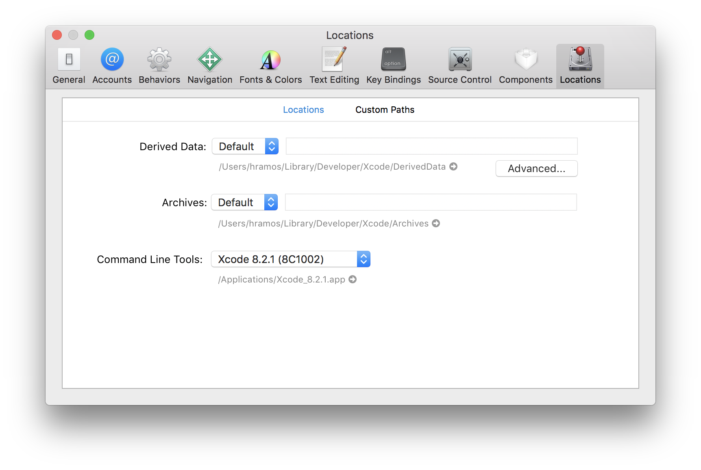
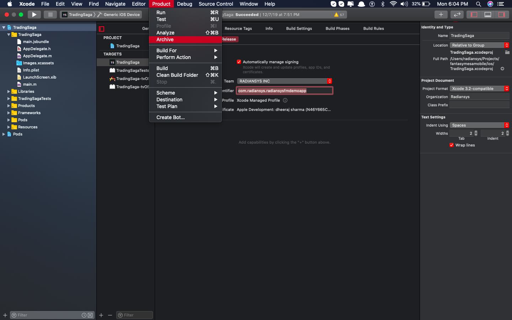
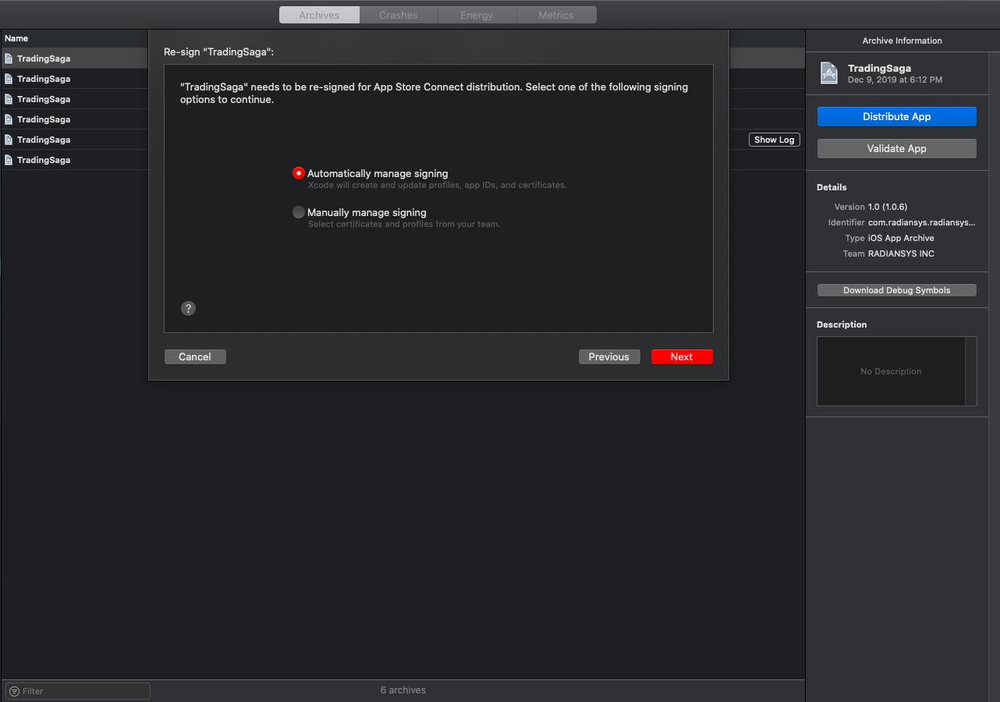

## Instructions on how to setup a dev env on Mac to build iOS app

### iOS development environment
- Install Xcode. The easiest way to install [Xcode](https://apps.apple.com/us/app/xcode/id497799835?mt=12) is via the Mac App Store. Installing Xcode will also install the iOS Simulator and all the necessary tools to build your iOS app.
  - If you have already installed Xcode on your system, make sure it is version 9.4 or newer.



- Install [Node](https://nodejs.org/en/download/) and [Watchman](https://facebook.github.io/watchman/) using [Homebrew](https://brew.sh/). Run following command to install brew

  ```brew
  /usr/bin/ruby -e "$(curl -fsSL https://raw.githubusercontent.com/Homebrew/install/master/install)"
  ```

- After installing brew run following commands to install Node and Watchman

  ```brew
  brew install node
  brew install watchman
  ```

- Install [Cocoapods](https://cocoapods.org/)

  ```shell
  sudo gem install cocoapods
  ```

### Build react-native
1. Clone mobile app code
    ```
    git clone git@gitlab.com:fantasy-mesa/trading-saga/app.git
    ```

2. Pull in dependent modules
    ```
    git submodule update --init
    ```

3. Install dependencies
    ```shell
    npm i
    npm run ios-pod-install
    ```

4. Start Metro server
    ```shell
    npm run metro-run
    ```
   You shall see the prompt in console window similar to the following.
   ```   
   To reload the app press "r"
   To open developer menu press "d"
   ```

### Build and run app via command line 
To deploy to iOS device or emu, get the list of available targets first
```
npm run ios-list-devices
```
You shall see similar spew
```
== Devices ==
MacBook Pro

== Simulators ==
iPad Pro (12.9-inch) (4th generation) (14.3) (6DF60A7F-4B71-44B2-A594-AA6CEF8694B8)
iPhone 12 Pro (14.3) (52BE0E3F-A537-402C-A704-701DB16B60FB)
```

To run on a device, it must must be connected to your Mac.

Run this command to build and install app on device
```shell
npm run ios --device '<device-name>'
```

Run this command to build and install app on emulator
```shell
npm run ios --simulator 'iPhone 11 Pro Max'
```

### Build and run an app with xcode

1. Add apple developer account. Select Xcode - Preferences
   

&nbsp;

2. Select **Accounts** - **+** - **Apple ID** - **Continue**
   

&nbsp;

3. Enter your credentials and add account
   

&nbsp;

4. After adding select the account select the account in Signing & Capabilities and Add bundle identifier.
   

&nbsp;

5. After selecting the account select Generic IOS Device
   

&nbsp;

6. Select Product and Archive
   

&nbsp;

7. It will start archiving the build
   
   &nbsp;

8. Once the build process is completed. Select the build and click on Distribute App
   
   &nbsp;

9. Select App Store Connect and click Next
   
   &nbsp;

10. Select Upload and click Next
    
    &nbsp;

11. Select both checkbox and click Next
    
    &nbsp;

12. Select Automatically manage signing and click Next
    
    &nbsp;

13. Click upload and it will start uploading the build to itunes connect
    
    &nbsp;
    
    &nbsp;

- **Initially the version number will be 1.0 and you have to change the build number every time you upload the build to Itunes Connect**
  
  &nbsp;

Copyright (C) 2021 [ALTAREY LLC](http://tradingsaga.com)
