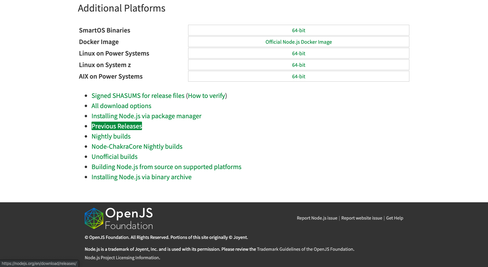
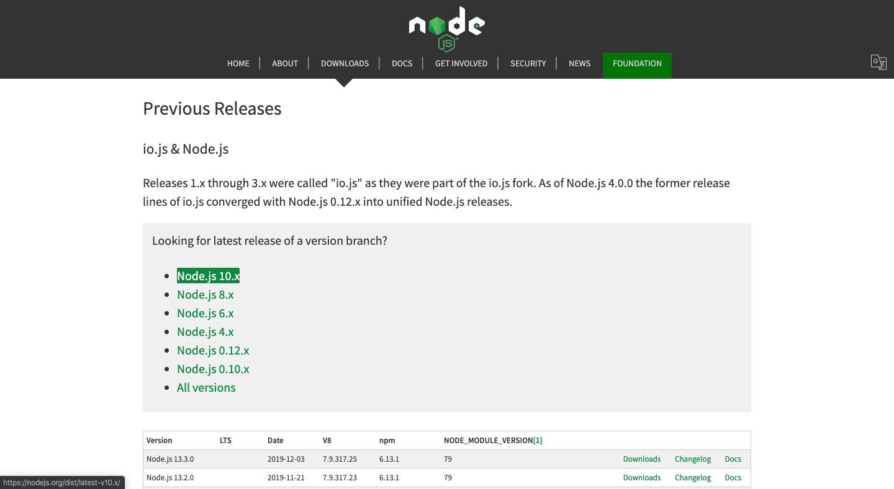
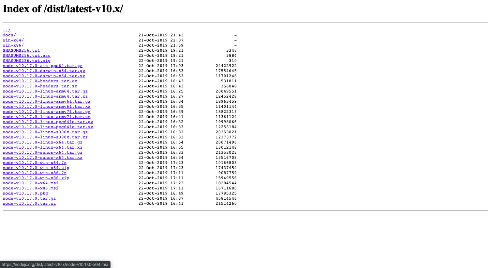
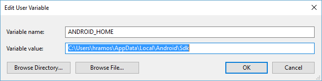

## Instructions on how to setup a dev env on Windows to build Android app

- Download [NodeJs](https://nodejs.org/en/download/) LTS for Windows (node-v10.17.0-x64.msi)
  - Select *Previous Releases* from home page
    
    &nbsp;
  - Select Node.js 10.x
    
    &nbsp;
  - Download the above mentioned version *node-v10.17.0-x64.msi*
    
    &nbsp;

- Install the Nodejs using downloaded setup file.
- When node is installed set path in Environment variables and add this line at the end of the Path Variable
  ```bash
  C:\Program Files\nodejs
  ```
- Restart the terminal or command prompt
- We recommend install [Chocolatey](https://chocolatey.org/) a popular package manager for Windows. Follow the given instructions in the link.
- Install [Python2](https://www.python.org/downloads/) and JDK8 using this command.

  ```bash
  choco install -y python2 jdk8
  ```

  - **If you have already installed Node on your system, make sure it is Node 8.3 or newer. If you already have a JDK on your system, make sure it is version 8 or newer**.
    &nbsp;

- Install windows build tools using this command

  ```bash
  npm install --global --production windows-build-tools
  ```
- Install node-gyp using this command

  ```bash
  npm install -g node-gyp
  ```

#### Android development environment

- [Install Android Studio](https://developer.android.com/studio/index.html). Make sure the boxes next to all of the following are checked:
  - Android SDK
  - Android SDK Platform
  - Performance (Intel ® HAXM) (See here for AMD)
  - Android Virtual Device

- Install the Android SDK

- Configure the ANDROID_HOME environment variable
  - Open the System pane under **System and Security** in the Windows Control Panel, then click on **Change settings**.... Open the **Advanced** tab and click on **Environment Variables**.... Click on **New**... to create a new ANDROID_HOME user variable that points to the path to your Android SDK.

  

  ```shell
  c:\Users\YOUR_USERNAME\AppData\Local\Android\Sdk
  ```

- Add platform-tools to Path
  - Open the System pane under **System and Security** in the Windows Control Panel, then click on **Change settings**.... Open the **Advanced** tab and click on Environment Variables.... Select the **Path** variable, then click **Edit**. Click **New** and add the path to platform-tools to the list.

  The default location for this folder is:

  ```shell
  c:\Users\YOUR_USERNAME\AppData\Local\Android\Sdk\platform-tools
  ```

### Build react-native
1. Clone mobile app code
    ```
    git clone git@gitlab.com:fantasy-mesa/trading-saga/app.git
    ```

2. Pull in dependent modules
    ```
    git submodule update --init
    ```

3. Start Metro server
    ```shell
    npm run metro-run
    ```
   You shall see the prompt in console window similar to the following.
   ```   
   To reload the app press "r"
   To open developer menu press "d"
   ```

### Build app
To build debug version apk
```shell
npm run android-build-debug-win
```

To build release version app
```shell
npm run android-build-release-win
```

### Run app on a device or emu
Connect device before running the following command
```shell
android-list-devices
```
You shall see similar spew
```
8_Foldable_API_29
Nexus_6_Edited_API_28
Pixel_2_API_28
Pixel_4_API_28
Pixel_API_18
```

To run app on a Pixel_4_API_28 emu
```shell
(emulator @Pixel_4_API_28 -accel on -no-snapshot-save & sleep 5) && npm run android-run"
```

Copyright (C) 2021 [ALTAREY LLC](http://tradingsaga.com)
