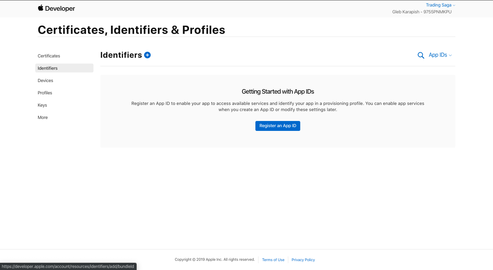

#Manually Publish App on Play Store

**Create An APP**
- Go to your [Play Console](https://play.google.com/apps/publish/)
- Select All Applications > Create Application
- Select a default language and add a title for your app. Type the name of your app as you want it to appear on Google Play.
- Create your app's [store listing](https://support.google.com/googleplay/android-developer/answer/113469#store_listing), take the [content rating questionnaire](https://support.google.com/googleplay/android-developer/answer/188189), and [set up pricing and distribution](https://support.google.com/googleplay/android-developer/answer/6334373).

**Prepare And Rollout Release**
- Create a Release
  - Go to your [Play Console](https://play.google.com/apps/publish/)
  - Select an app
  - On the left menu, select *Release management* > *App releases*.
    - If you don't see the App releases in the menu, make sure you have [permission to manage releases](https://support.google.com/googleplay/android-developer/answer/2528691#definitions).
  - Next to the release type you want to create, select *Manage*. You can select between *Internal test*, *Closed*, *Open* and *Production*
  - To create a new release, select Create Release.
- Prepare your app's release
  - Follow the on-screen instructions to add APKs or app bundles, describe what's new in this release, and name your release. For more information on any of these fields, select the matching section heading below.
  - To save any changes you make to your release, select *Save*.
  - When you've finished preparing your release, select *Review*.
- Review and Roll out your release
  - Go to your [Play Console](https://play.google.com/apps/publish/)
  - Select an app
  - On left menu, select *Release management* > *App releases*.
  - Next to release you want to roll out, select *Edit release*.
  - Review your draft release and make any additional changes that are needed.
  - Select *Review*. You'll be taken to the *"Review and roll out release"* screen, where you can make sure there aren't any issues with your release before rolling out to users.
  - Review any warnings or errors.
  - If you're updating an existing app, select a rollout percentage.
    - If you're rolling out your first  release, you won't see the option to select a rollout percentage.
    - For details on how to target a staged rollout to specific countries, go to *release app updates with staged rollouts*.
  - Select *Confirm rollout*.
    - If you're rolling out your app's first release on production, clicking *Confirm rollout* will also publish your app to all Google Play users in the countries you selected.

##Manually Publish App on App Store

**Generating the App ID**
 - You'll need to generate a ID to every app your make. To do that, log into your [apple developer account](https://idmsa.apple.com/IDMSWebAuth/signin?appIdKey=891bd3417a7776362562d2197f89480a8547b108fd934911bcbea0110d07f757&path=%2Faccount%2F&rv=1). Remember that you need to buy the iOS development and iOS distribution certificates to be able to publish something to the app store (you can buy a 1-year certificate for US$99).
 - Once logged, go to *Certificates, Identifiers and Profiles* menu
 &nbsp;
 
 &nbsp;
 - On the left Menu, select Identifiers. Click the *plus icon* to create a new identifier.
 &nbsp;
 
 &nbsp;
 - Select the first option i.e., App ID and Continue
 &nbsp;
 
 &nbsp;
 - You should set a Bundle ID (that should match the one in Xcode project). Apple suggests that your Bundle ID follow the model: *country abbreviation* + *.com* + *.* + *organization* + *.* + *app name*.
 &nbsp;
 
 &nbsp;
 &nbsp;
 
 &nbsp;
 - Once you finish, the Identifier should appear on the list along with the XC Wildcard.

**Building The Archive in Xcode**
- Once you've finish your app, you need to generate the Archive that will be uploaded to App Store Connect. Inside your Xcode project, go to the Project Navigator (first icon on the left menu, the one that looks like a folder). Here, you need to ensure two main things are correct: the app Version and Build.
- If this is the first version you are launching to the store, you should let the default option (1.0) in Version. The Build corresponds to the versions you upload to the App Store connect (the released and rejected ones). Thus, *everytime* you make a new Archive, you should manually increment the build by one.
- Next step is effectively building the archive. Go to the Product Menu and select Archive.
&nbsp;
 
 &nbsp;
- The archive menu should open. Select the archive you just made and click in Distribute App.
&nbsp;

&nbsp;
- Unless you want something very specific, let the following options in the default and click next until you receive the confirmation that your app is being processed.

**App Store Connect Setting**
  - **Creating the new app**
    - Log into your developer account. Choose the App Store Connect menu.
      &nbsp;
      
      &nbsp;
    - Go to the top left menu. Select My Apps.
      &nbsp;
      
      &nbsp;
    - Add a New App
      &nbsp;
      
      &nbsp;
    - Select iOS. Give the app a name (this one will appear on the App Store!), select the primary language,
    and the Bundle ID you generated in the first step of tutorial. Choose a ID for your app (this won't ve visible on App Store). Create.
  - **App Information**
    - You have to fill basic info about your app.
    - You have to add App name, category and other information
    - You should provide a Privacy Policy URL. If you already have a website, create a page for this.
  - **Pricing and Availability**
    - Set the price your app will be sold for (or if it is costless). Also, check the availability of your app.
  - **Submit for Review**
    - Now, go to the last side menu and set all the other info about your app.
    - For app previews and screenshots: you'll need a 5.5" display(the iPhone 8 Plus screen), a 6.5" display (the iPhone XR screen) and a 12.9" display (the iPad Pro 12.9" screen) screenshot. You can use the same screenshots for 2nd and 3rd generation iPads.
    - To easily get the screenshots, build your app on Xcode using the device simulators.
    - The app previews are not essential.
    - The support URL is a webpage with support info you need to provide. If you already have a website, create a page for this.

**Review and Publishing**
- Once everything is set, save your app and submit for review.
- Apple says that 50% of the apps are processed within 48 hours, and 90% within 72 hours. Generally the app will enter *In Review* mode in one day.
- Once approved, the status will change to *Ready for Sale*. Still, it will take a few hours to appear on the App Store search.

## Contact

Copyright (C) 2021 [ALTAREY LLC](http://tradingsaga.com)
